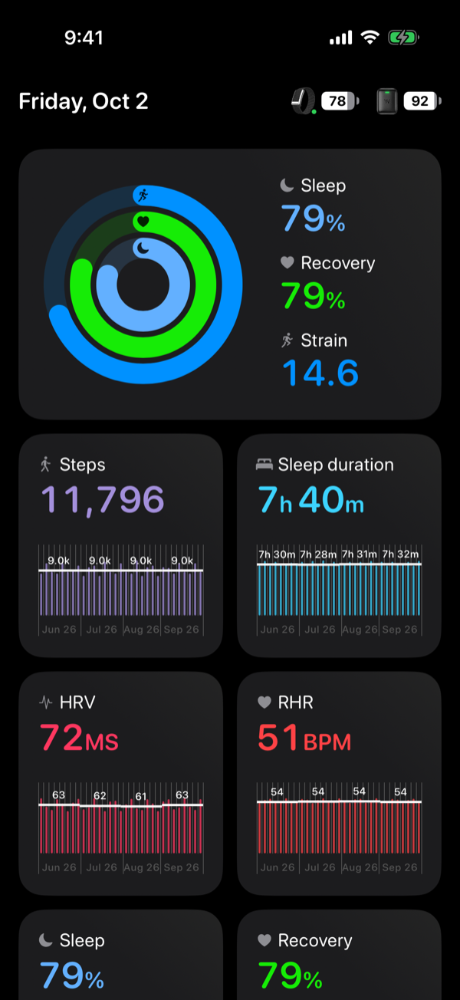

# WHOOP iOS

An unofficial, offline-first iPhone client for a WHOOP 5 you own. It talks to
the strap over Bluetooth, keeps every packet on your phone, and computes sleep,
recovery, and strain locally, with no membership required.



*Screenshot uses synthetic demo data.*

## What it does

- Pairs with a WHOOP 5 and collects heart rate, R–R intervals, and motion in
  the background.
- Stores raw packets and derived metrics in an on-device SQLite database.
- Shows Sleep, Recovery, Strain, Steps, sleep duration, HRV, and RHR with
  full-history charts.
- Optionally imports your past WHOOP history so charts start full.
- Optionally replicates an encrypted backup to a backend you control.

## Quick start

Try the UI in the simulator with fake data:

```bash
brew bundle --file Brewfile
xcodegen generate
open Sleep.xcodeproj   # Run the "Sleep" scheme with WHOOP_DEMO_DATA=1
```

To run it on your own phone with your own strap and history, follow
**[setup](docs/setup.md)**.

## Docs

| Doc | For |
| --- | --- |
| [Setup](docs/setup.md) | Signing, installing, and importing your history |
| [Architecture](docs/architecture.md) | How the collector, store, and UI fit together |
| [Testing](docs/testing.md) | Local gates and CI |
| [Data migration](docs/whoop-data-migration.md) | Full export, archive, and model pipeline |
| [Operator runbook](docs/operator.md) | Shipping and backups for a live install |
| [History](docs/history.md) | Development log |
| [Contributing](CONTRIBUTING.md) | Code rules |

## Status

Personal project, used daily. Sleep staging and recovery models are versioned
local approximations, not WHOOP's algorithms.

WHOOP is a trademark of WHOOP, Inc. This project is not affiliated with or
endorsed by WHOOP, Inc. The protocol layer uses independently implementable
facts; NOOP's PolyForm Noncommercial license applies to any code borrowed from
it.
